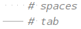

# Indentation and whitespace

## Indentation

Python is sensitive to indentation (i.e. [whitespace ](https://en.wikipedia.org/wiki/whitespace_character) at the beginning of lines). 
This is because indentation determines the "code block"
to which a statement pertains. All statements within a code block have the same indentation level.

### Spaces vs tabs

A single level of indentation consists of either four spaces or one [tab ](https://en.wikipedia.org/wiki/Tab_key) character (a tab character is the character that gets written to a text file when you press the <kbd>Tab</kbd> key on your keyboard).
You have to use either spaces or tabs, **but not both**: if you mix tabs and spaces you
are prone to get one of these errors:
```text
TabError: inconsistent use of tabs and spaces in indentation
```

It is best to use only spaces to avoid any such errors.
You can configure this in PyCharm by opening the settings (<kbd>&shortcut:ShowSettings;</kbd> or
File > Settings), navigating to `Editor > Code Style > Python > Tabs and Indents`
and uncheck "Use tab character".

### Inspect the void!

Additionally, it is good to enable the option to see whitespace, so you can see what's going on
in the blank spaces in your code, if you ever run into a problem with this. 
To do this, check "Show whitespace" in `Editor > General > Appearance` in the settings.

Whitespace will look like this:



## Whitespace between tokens

Other than indentation, whitespace between tokens (elements of the Python syntax) doesn't matter:
```python
1 + 7*(3*4 - 5)
```
is the same as
```python
1+    7 *(  3*4-5)
```
(although you shouldn't use the latter style because it's not very readable!).


## Task

The code in the editor shows different levels of indentation.

Also, there's inconsistent indentation: there's a tab character hidden somewhere.
Hunt it down and replace it with four spaces.
