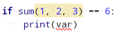

# Error ahoy!

As you go on in your programming journey, you'll notice that not everything is smooth 
sailing—in fact, most of the time you will be dealing with errors of some sort or another.

Errors arise when you intend to make your program do one thing but what you write
is either not understood by Python (i.e. you use the wrong syntax), or does not match exactly
what you intended. This happens more often than you would think, even for experienced 
programmers! Thus, dealing with errors is a very important skill to have.

## Error messages

There is a kind of errors that prevent your program from running or halt it while it's
doing so. These errors usually come with an error message. The first step in dealing with
these is always to **read the error message!** It contains useful information such as where
the error occurred, and what its precise cause was.

Error messages may sometimes seem cryptic and useless, but it's important to always make
the effort to read and try to interpret their meaning so that with time
you'll have a much easier time dealing with them.

### Syntax errors

While you're still in the early stages of learning Python, one of the most common mistakes
you'll make is a syntax error.

Syntax errors are the equivalent of spelling or grammar mistakes in natural languages such as
English. The main difference is that humans can usually approximately understand what another
person meant if they make such a mistake—but the Python interpreter lives in a computer:
if you make a syntax error, Python won't understand what you want it to do, and it's
not able to reliably guess that without you writing it correctly (not that we would want it
to!).

An example of a syntax error:
```text
 File main.py, line 6
    "hello
         ^
SyntaxError: EOL while scanning string literal
```
This indicates that we forgot to add a closing double-quote to the string `"hello"`.
(Don't worry about what a string is for now.)  

### Exceptions that stop your program

Some errors that you'll encounter often come in the form of an *exception*: something
that causes the Python interpreter to stop running your program because it encountered an
exceptional situation which you didn't specify how to deal with.
(We'll go into more detail about exceptions later in the course.)

These look something like this:
```text
Traceback (most recent call last):
  File main.py, line 4, in <module>
    print(math.sqrt(-1))
ValueError: math domain error
```

## IDE to the rescue

Your IDE (in this case, %IDE_NAME%) will highlight pieces of code that are potential errors
before you even run your code. This is very helpful to catch errors as you're writing code.
So, look out for pieces of code highlighted in a suspicious colour!




## Task

The `main.py` file open in the editor is trying to compute the square root of 2, but it
contains an error. Run it and see what happens!
Read the error message, and try to see if you can fix it!
