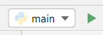

# Python files

Python programs are written in text files with the extension `.py`, e.g. `hello_world.py`.
Each line or group or lines contains a *statement*, an instruction that the interpreter 
executes. (More on statements later; for now just think of a statement as a "command".)

Depending on the context, Python files (files ending in `.py`) are also called *scripts* or 
*modules*. We'll see the meaning of these terms later on.

## Running a Python file from the terminal

To run a program written in such a file, we can invoke the Python interpreter from the 
terminal and give it the file path as an argument:
```bash
python main.py
```
This will run the `main.py` program in the terminal.

### Try it!

Open the terminal window (in %IDE_NAME%, you can open the integrated terminal with 
<kbd>&shortcut:ActivateTerminalToolWindow;</kbd> or by clicking on the Terminal icon in the
toolbar at the bottom) and type
```bash
python "Preliminaries/Python as a programming language/Python files/main.py"
```
(pressing <kbd>Enter</kbd> afterwards). This will run the Python file that you can see in the
editor! (Don't worry, for now you don't need to understand anything that's going on there,
just run the program.)

The program will make the prompt `Please enter your name: `. Enter your name and see what 
happens.


## Running from PyCharm

PyCharm provides several shortcuts to run a Python file. You can run the Python file currently
open in the editor with <kbd>&shortcut:RunClass;</kbd>. This also creates a run configuration, 
as you can see in the top right corner of the IDE:  

After a run configuration has been created, you can run it whenever you want by clicking the
green "play" triangle, or by using <kbd>&shortcut:Run;</kbd>.

In this course, you can also run the Python file attached each in theory task by clicking the
<kbd>Run</kbd> button at the bottom of the task description. Give it a try!

But behind the scenes, when you click a button such as <kbd>Run</kbd>, a command like the one you used above gets executed.

To stop a running program, you can click the red "stop" square (either in the `Run` tooltip, 
which you can open with <kbd>&shortcut:ActivateRunToolWindow;</kbd>, or in the top-right 
toolbar).
