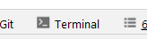

# The terminal: a crash course

The [**terminal** ](https://en.wikipedia.org/wiki/Command-line_interface) is a program that allows you to execute commands on your computer and run other programs with text-based input and output. Depending on the context it is also sometimes called *shell* or *console*, though how these names are used is often confusing; [this link](https://superuser.com/questions/144666/what-is-the-difference-between-shell-console-and-terminal) contains an explanation of the exact meaning of each term.

Each operating system (OS) provides its own terminal or terminal-like program, but PyCharm provides its own so that you don't have to switch to another window outside the IDE.
To open PyCharm's built-in terminal, use the shortcut <kbd>&shortcut:ActivateTerminalToolWindow;</kbd>, or click on the Terminal tooltip in the bottom sidebar:



## Prompt

The [**prompt** ](https://en.wikipedia.org/wiki/Command-line_interface#Command_prompt) is a sequence of characters at the beginning of a line in the terminal that indicates you can input a command after it (by typing text and pressing <kbd>Enter</kbd>).

The exact prompt that you get in the terminal depends on your OS, since each has its own [**shell** ](https://en.wikipedia.org/wiki/Shell_(computing)) (the program that interprets and executes your commands); but in general, it will consist of your [working directory ](https://en.wikipedia.org/wiki/working_directory) (the directory you opened your terminal in) followed by a separator character.


For example, in Linux/Mac, it will look something like this:
```text
John@Computer: ~/path/to/directory $ 
```
You would enter your command after the `$` sign.

In Windows' `cmd`, you will see something like this instead:
```text
C:\Users\John\path\to\directory>
```
In this case you would enter your command after the `>` sign.


## Try it!

Open PyCharm's terminal as we described before, type the following command after the prompt and press <kbd>Enter</kbd>. This command will output your working directory!


If you're on Linux/Mac, the command is
```text
pwd
```

On Windows:
```text
cd
```
